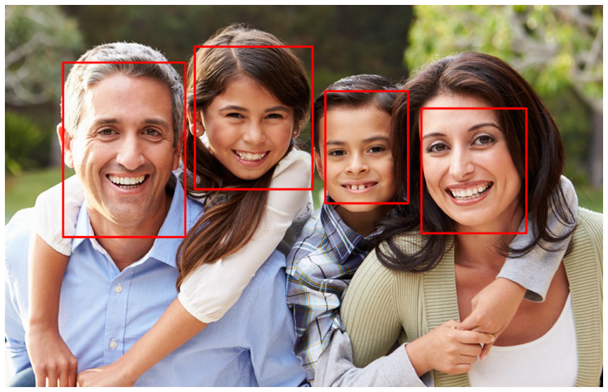

# Face Detection Using RetinaNet

 The Face Detection model is trained to detect faces in images and draw bounding boxes around them by utalizing retina-net model.

## Note

I ran the code on Google Colab and forgot to create the `requirements.txt` file. Please install the necessary dependencies manually.


## Dataset

The dataset used for training and testing is the face detection dataset from DataTurks, which contains images with labeled faces.

### Download and Extraction

The dataset is downloaded and extracted using the following commands in the notebook:

```python
!wget -nc https://lazyprogrammer.me/course_files/face_detection.json
```

### Dataset Structure

The dataset contains images with annotations for face bounding boxes. Each annotation includes the coordinates of the bounding box and the class label (face).

#### Example
```json
{
  "annotation": [
    {
      "imageHeight": 333,
      "imageWidth": 650,
      "label": ["Face"],
      "notes": "",
      "points": [
        {
          "x": 0.08615384615384615,
          "y": 0.3063063063063063
        },
        {
          "x": 0.1723076923076923,
          "y": 0.45345345345345345
        }
      ]
    },
    {
      "imageHeight": 333,
      "imageWidth": 650,
      "label": ["Face"],
      "notes": "",
      "points": [
        {
          "x": 0.583076923076923,
          "y": 0.2912912912912913
        },
        {
          "x": 0.6584615384615384,
          "y": 0.46846846846846846
        }
      ]
    }
  ],
  "content": "http://com.dataturks.a96-i23.open.s3.amazonaws.com/2c9fafb064277d86016431e33e4e003d/8186c3d1-e9d4-4550-8ec1-a062a7628787___0-26.jpg.jpeg",
  "extras": null
}
```

## Experiment Result

### Training

- Epoch: 15
- Regression Loss: 1.0376
- Classification Loss: 19%

### Predication Example



## Prerequisites
- Python 3.x
- Required libraries: numpy, keras, tensorflow, scipy, matplotlib, PIL, requests

## Contributing

Contributions are welcome! Feel free to open issues or submit pull requests.

## Contact

For any inquiries or support, please contact [Adnan AlKharfan](https://github.com/adnanAlKharfan/Style-Transfer).
